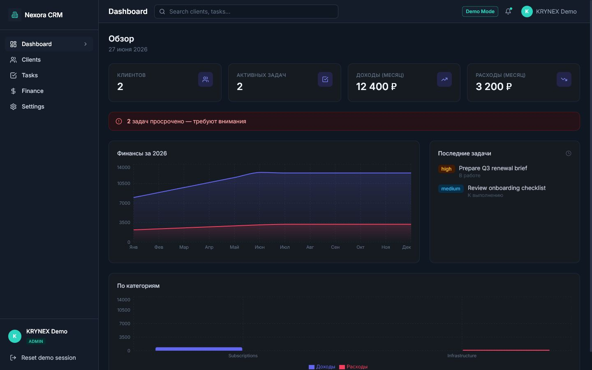
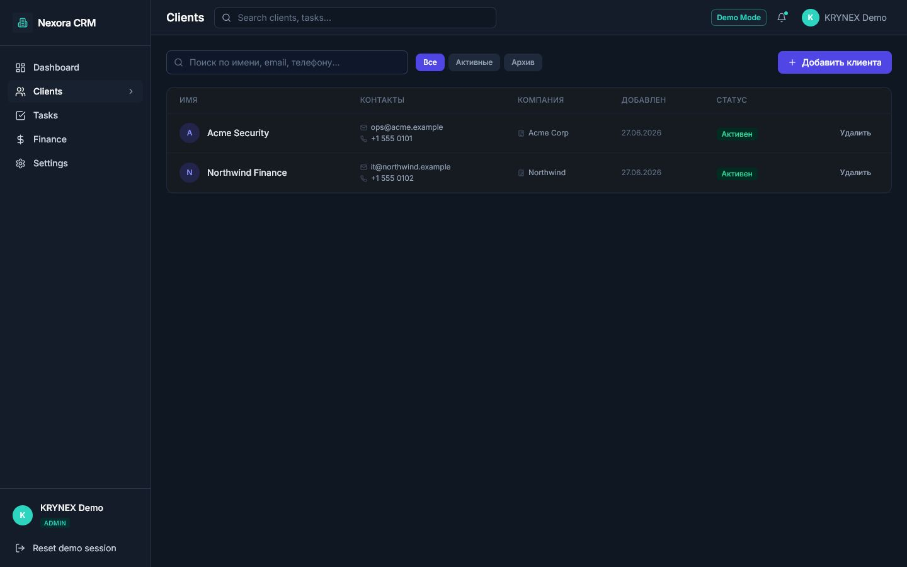
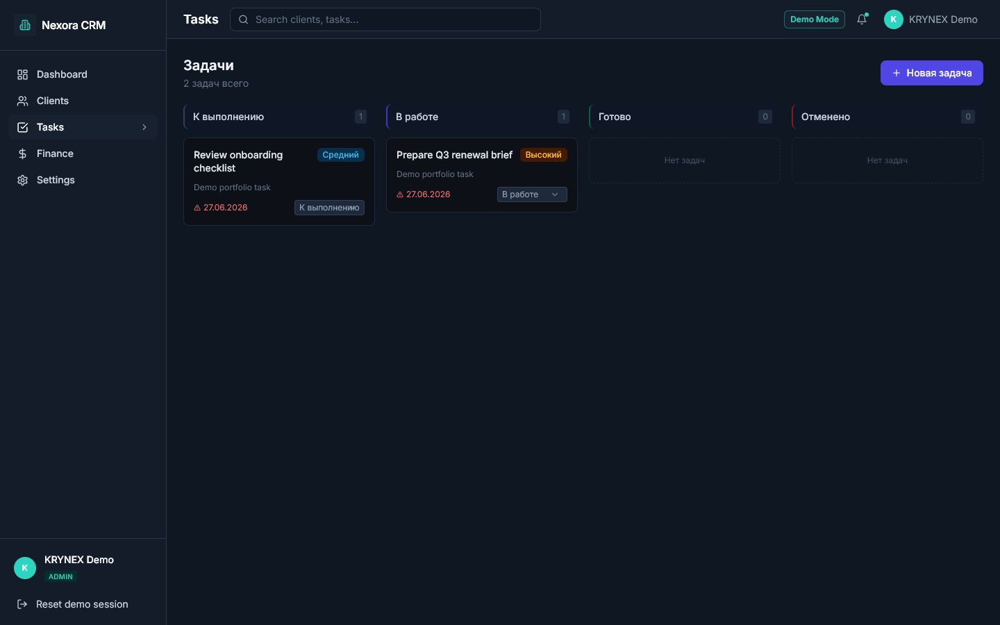
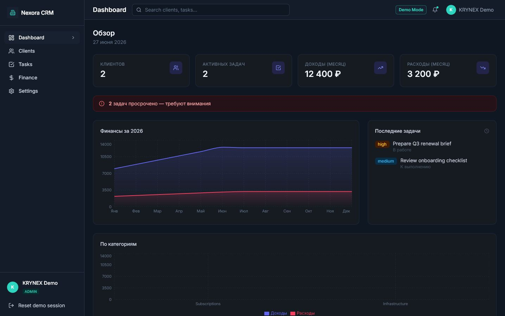

# Nexora CRM V1.0
Business CRM dashboard for clients, tasks and finance workflows in the KRYNEX Labs ecosystem.

## Product Overview

Nexora CRM is a public MVP/portfolio CRM product. It demonstrates a business SaaS dashboard with customer records, task management, finance summaries and a C++ backend architecture. The public version is prepared for demo review and is not a production CRM deployment.

## Key Features

- Client and company record management.
- Task tracking with priority and deadline fields.
- Finance entries and monthly reporting.
- Dark KRYNEX dashboard shell shared with the security products.
- Demo mode for dashboard preview without forcing real registration.

## Architecture

The frontend is a React/Vite application. The backend is a C++ Crow service with PostgreSQL persistence, JWT auth for non-demo development and modular route handlers.

## Tech Stack

- Frontend: React, TypeScript, Vite, TailwindCSS, React Query
- Backend: C++17, Crow, libpqxx
- Data: PostgreSQL
- Packaging: Docker Compose, CMake

## Screenshots



| List view | Detail view | Settings |
| --- | --- | --- |
|  |  |  |

## Quick Start

```bash
cp .env.example .env
docker compose up --build
```

Frontend: <http://localhost>  
Backend health: <http://localhost:8000/api/health>

## Demo Mode

Set `DEMO_MODE=true` and `VITE_DEMO_MODE=true` for public demos. The frontend can show the dashboard with a local demo user. When demo mode is off, the normal backend auth flow remains in place.

## Environment Variables

Use `.env.example` as a public-safe template. Do not commit real `.env` files. Key variables include `DEMO_MODE`, `DB_*`, `JWT_SECRET`, `ALLOWED_ORIGINS`, `VITE_API_URL` and `VITE_DEMO_MODE`.

## API Overview

- `POST /api/v1/auth/login` - normal local login when demo mode is off.
- `POST /api/v1/auth/register` - local development registration.
- `GET /api/v1/auth/me` - current user.
- `/api/v1/clients`, `/api/v1/tasks`, `/api/v1/finance` - CRM resources.
- `/api/health` - health check.

## Project Structure

```text
backend/      C++ API service
frontend/     React dashboard
docker/       Nginx config
workflows/    CI workflow
docker-compose.yml
```

## Security Scope

Nexora CRM is not a cybersecurity tool. Its public version avoids real secrets, real accounts and production auth claims. JWT and user flows are for local development only.

## Roadmap

### Already implemented

- C++ Crow backend with PostgreSQL persistence, JWT auth and modular route handlers.
- React/Vite dashboard for clients, tasks, finance and demo-mode preview.
- C++ CSV export and import parser with quote escaping and malformed-row validation.
- C++ required-header validation for safe client, task and finance import workflows.
- Windows/MSVC build fixes, OpenSSL PBKDF2 password hashing and JWT base64url padding fix.
- Production guardrails plus CTest coverage for password, JWT and utility behavior.

### Will be implemented

- Richer public demo CRM seed data and read-only hosted demo controls.
- Pipeline and deal board views for sales workflow review.
- Import/export endpoint wiring for demo records and lightweight audit/settings screens.
- End-to-end smoke tests for auth, clients, tasks and finance.

## KRYNEX Ecosystem

Nexora CRM represents the business SaaS side of KRYNEX Labs next to SentinelX, ThreatVault, LogForge and VulnScope.

## License

MIT.
<!-- Project version: Nexora CRM V1.0 -->


